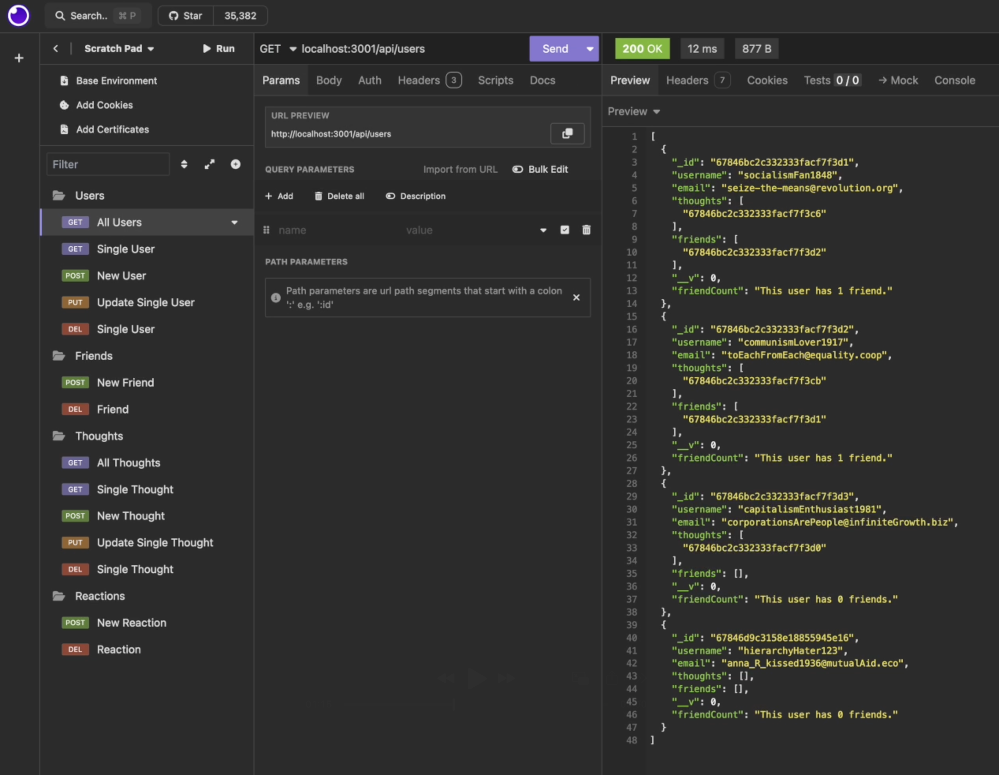

# Social Network API

## Description

This project was an exercise in building a server-side application from scratch, using [TypeScript](https://www.typescriptlang.org/), [Express](https://expressjs.com/), [MongoDB](https://www.mongodb.com/), and [Mongoose](https://mongoosejs.com/). It simulates a social media site where Users can post "Thoughts", add friends, and post "Reactions" to Thoughts. Using Mongoose Object Database Manager, I built controllers that allow users to GET, POST, PUT, and DELETE Users, Thoughts, and Reactions.

## Usage

[View a video demonstration here.](https://drive.google.com/file/d/1hi8bgMsrbQd8o9Vq5pxs5VxaiS8rCEdK/view?usp=sharing)

The demonstration uses Insomnia to test all of the route endpoints.

## License

This repository uses an [MIT License ↗️](./LICENSE.txt).
